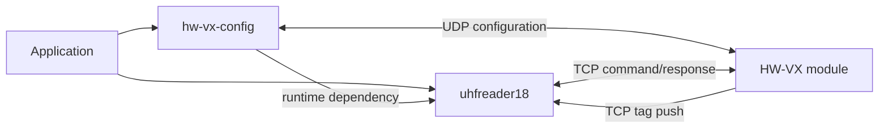

# uhfreader18

[](https://pypi.org/project/uhfreader18/)
[](https://pypi.org/project/uhfreader18/)
[](LICENSE)
[](https://github.com/xynogen/uhfreader18/actions/workflows/ci.yml)

Dependency-free Python library for the UHFReader18 reader stack. It speaks the
**two independent protocols** the hardware uses:

| Protocol | Transport | Package | Docs |
|---|---|---|---|
| **RFID air-interface** — command/response, CRC-validated parsing, autonomous tag push, heartbeats | TCP / RS232 / RS485 | `uhfreader18` (top level) | [`docs/uhfreader18/`](docs/uhfreader18/) |
| **HW-VX IP-module config** — network, serial, and DHCP settings for the HW-VX6330K / HW-VX6346KL TCP-IP bridge | UDP broadcast | `uhfreader18.hwvx` | [`docs/hwvx_module/HWVX.md`](docs/hwvx_module/HWVX.md) |

The two protocols share nothing but the device they run on — even their setting
codes use unrelated numbering (baud index `0` = 9600 on the reader, 1200 on the
HW-VX module). The [`hw-vx-config`](https://pypi.org/project/hw-vx-config/) CLI
is a thin front-end over `uhfreader18.hwvx`.

## Contents

- [Features](#features)
- [Requirements](#requirements)
- [Install](#install)
- [Quick Start](#quick-start)
- [RFID Air-Interface](#rfid-air-interface)
  - [Command client](#command-client)
  - [Parse a push stream](#parse-a-push-stream)
  - [Build frames](#build-frames)
  - [Receive server](#receive-server)
- [HW-VX Module Configuration](#hw-vx-module-configuration)
- [API Reference](#api-reference)
- [Protocol Summary](#protocol-summary)
- [Package Relationship](#package-relationship)
- [Development](#development)
- [Current Limits](#current-limits)
- [License](#license)

## Features

**RFID air-interface (`uhfreader18`)**

- Build and CRC-sign command and response frames (CRC-16/CCITT-reflected).
- 13 typed reader-defined operations: reader info, address, power, region, scan
  time, baud rate, Wiegand, work mode, EAS accuracy, Syris/trigger offset.
- Discover the reader's configured address via broadcast `0xFF`.
- Reassemble fragmented or combined TCP response streams (`StreamBuffer`).
- Parse autonomous `0xEE` tag reports and six-byte heartbeats.
- Filter pushed frames by a reader-address allowlist.
- Decode reader-info bytes (model, protocols, frequency band) and work-mode bytes
  (Wiegand format, state flags, memory target) through typed properties.
- Run a dependency-free TCP receive server (`uhfreader18-server`).

**HW-VX module (`uhfreader18.hwvx`)**

- Discover every HW-VX module on the LAN by UDP broadcast.
- Read and write the full device configuration (network, serial, advanced).
- Change IP / subnet / gateway, toggle DHCP, and reboot.
- Client-side validation rejects a bad config before it reaches the device.

**Both** — fully typed (`py.typed`), zero runtime dependencies, 100% test coverage.

## Requirements

- Python 3.10 or newer.
- Network access to the reader — directly, or through the HW-VX serial-to-Ethernet bridge.

## Install

```bash
pip install uhfreader18
```

## Quick Start

```python
from uhfreader18 import RfidClient

with RfidClient("192.168.1.100", 2077) as reader:
    info, address = reader.discover_address()
    print(f"address = 0x{address:02X}")
    print(f"firmware = {info.version}")
    print(f"model = {info.reader_model}")        # ReaderType | None
    print(f"protocols = {info.protocols!s}")     # Protocol flags
    print(f"band = {info.band}, ch {info.min_index}-{info.max_index}")
    print(f"power = {info.power} dBm")
```

```python
from uhfreader18.hwvx import HwVxNetworking

with HwVxNetworking() as net:                    # UDP broadcast
    for r in net.search():
        print(r.ip_address, r.mac_address, r.device_name)
```

---

## RFID Air-Interface

### Command Client

`RfidClient` opens one TCP connection and runs one command at a time, waiting
for the complete matching response and handling TCP fragmentation internally.

```python
from uhfreader18 import (
    FreqBand, MemInven, ModeState, ReaderBaudRate, RfidClient, WorkMode,
)

with RfidClient("192.168.1.100", 2077, timeout=3.0) as reader:
    info = reader.get_reader_info(adr=0x00)
    reader.set_address(current_adr=0x00, new_adr=0x01)
    reader.set_power(adr=0x01, power=30)
    reader.set_scan_time(adr=0x01, scan_time=10)
    reader.set_region(adr=0x01, band=FreqBand.US, max_index=45, min_index=10)
    reader.set_baud_rate(adr=0x01, baud=ReaderBaudRate.BAUD_115200)
    reader.set_work_mode(
        adr=0x01,
        work_mode=WorkMode.SCAN,
        state=ModeState.RS_OUTPUT | ModeState.BEEP_OFF,
        mem_inven=MemInven.EPC,
        first_adr=0, word_num=4, tag_time=0,
    )
    reader.acousto_optic_control(adr=0x01, active_t=1, silent_t=1, times=3)
    work = reader.get_work_mode(adr=0x01)
    print(work.work_mode, work.wiegand_format, work.state_flags)
```

Every protocol option is an enum parameter, not a magic byte: `FreqBand`,
`ReaderBaudRate`, `WorkMode`, `ModeState`, `MemInven`, `WiegandFormat`. The
client packs them into wire bytes itself (e.g. band into bit7-6 of the
frequency byte), and rejects a bare `int` with `TypeError` even from untyped
callers. Plain `int` parameters are only used for real numbers (power, times,
addresses) and are range-checked.

All `set_*` / control methods return an `RfidResponse` (`.ok`, `.status_text`).
`get_reader_info` returns `ReaderInfo`; `get_work_mode` returns `WorkModeInfo`.

| Method | CMD | Returns | Purpose |
|---|---|---|---|
| `get_reader_info(adr=0)` | `0x21` | `ReaderInfo` | Address, firmware, protocol, power, frequency, scan time |
| `discover_address()` | `0x21` | `(ReaderInfo, int)` | Find configured address via broadcast `0xFF` |
| `set_region(adr, band, max_index, min_index)` | `0x22` | `RfidResponse` | `FreqBand` + channel indices 0–63 |
| `set_address(current_adr, new_adr)` | `0x24` | `RfidResponse` | Change reader address (EEPROM) |
| `set_scan_time(adr, scan_time)` | `0x25` | `RfidResponse` | Inventory scan time (3–255 × 100 ms) |
| `set_baud_rate(adr, baud)` | `0x28` | `RfidResponse` | `ReaderBaudRate` (9600–115200) |
| `set_power(adr, power)` | `0x2F` | `RfidResponse` | RF output power (0–30) |
| `acousto_optic_control(adr, active_t, silent_t, times)` | `0x33` | `RfidResponse` | LED / buzzer |
| `set_wiegand(adr, wg_format, data_interval, pulse_width, pulse_interval)` | `0x34` | `RfidResponse` | `WiegandFormat` flags + timings |
| `set_work_mode(adr, work_mode, state, mem_inven, first_adr, word_num, tag_time)` | `0x35` | `RfidResponse` | `WorkMode`, `ModeState` flags, `MemInven` |
| `get_work_mode(adr=0)` | `0x36` | `WorkModeInfo` | Read Wiegand + work-mode params |
| `set_eas_accuracy(adr, accuracy)` | `0x37` | `RfidResponse` | EAS alarm accuracy (0–8) |
| `set_syris_response_offset(adr, offset_ms)` | `0x38` | `RfidResponse` | Syris485 response offset |
| `set_trigger_offset(adr, trigger_s)` | `0x3B` | `RfidResponse` | Trigger offset (firmware ≥ V2.36) |

### Parse a Push Stream

TCP does not preserve message boundaries. Keep one `StreamBuffer` per
connection and feed every received chunk in arrival order:

```python
from uhfreader18 import StreamBuffer

stream = StreamBuffer(allowed_readers={0x00, 0x01})   # allowlist optional
result = stream.feed(tcp_bytes)                        # -> ParseResult

for response in result.frames:
    print(response.tag, response.reader_address, response.command_name, response.status_name)

for heartbeat in result.heartbeats:
    print("heartbeat", heartbeat.hex_readable())

for error in result.errors:
    print("protocol error", error)
```

`RfidResponse.tag` renders the response data as uppercase hex after removing
trailing NUL bytes. It stays an opaque report value: available captures do not yet prove
where flags, antenna metadata, EPC, and padding split for every reader.

### Build Frames

```python
from uhfreader18 import (
    Command, Status,
    build_command_frame, build_response_frame, build_heartbeat,
    crc16, validate_frame, parse_response,
)

cmd = build_command_frame(0x00, Command.GET_READER_INFO)
report = build_response_frame(
    0x00, Command.TAG_REPORT, Status.SUCCESS,
    bytes.fromhex("2000708C2B380B2D00000000"),
)
response = validate_frame(report)        # -> RfidResponse, raises FrameError on bad CRC/length
response = parse_response(report)        # -> RfidResponse
beat = build_heartbeat()                 # 56 00 00 00 00 00
```

### Receive Server

```bash
uhfreader18-server                              # 0.0.0.0:2077
uhfreader18-server --host 0.0.0.0 --port 2077
uhfreader18-server --allowed-readers 00,01      # hex allowlist
uhfreader18-server --fields tag,reader,cmd,status,peer
uhfreader18-server --debug
```

The server validates and logs reports. Applications needing custom sinks should
use `StreamBuffer` directly.

---

## HW-VX Module Configuration

Configure the HW-VX6330K / HW-VX6346KL IP module over UDP. `HwVxNetworking` is
the low-level transport (search + request/response); `HwVxDevice` is the
high-level per-reader API.

```python
from ipaddress import IPv4Address

from uhfreader18.hwvx import BaudRate, HwVxDevice, HwVxNetworking, NetWorkMode

# Discover modules on the LAN.
with HwVxNetworking() as net:
    for found in net.search():                       # -> list[SearchResult]
        print(found.ip_address, found.port_number)   # IPv4Address, int

# Read and change a device's configuration.
with HwVxDevice(IPv4Address("192.168.1.100")) as dev:
    dev.connect()                               # search + select + login
    cfg = dev.get_config()                      # -> DeviceConfig, typed
    cfg.work_mode = NetWorkMode.CLIENT
    cfg.baud_rate = BaudRate.BAUD_115200
    cfg.remote_ip = IPv4Address("192.168.1.50")
    cfg.remote_port = 5000
    dev.save_config(cfg)                        # validate + write + reboot

    dev.change_network(
        IPv4Address("192.168.1.50"),
        IPv4Address("255.255.255.0"),
        IPv4Address("192.168.1.1"),
    )
    dev.set_dhcp(True)
    dev.reboot()
```

`DeviceConfig` holds **typed values**: `IPv4Address` for addresses, `int` for
ports and counters, and the module enums (`NetProtocol`, `NetWorkMode`,
`BaudRate`, `Parity`, `DataBits`, `Toggle`) for every option. An invalid
address or an out-of-range option cannot be constructed, so it cannot reach
the device. The UDP protocol's raw strings are converted exactly once, at
`DeviceConfig.from_wire` / `to_wire`; `save_config` runs `validate()` first
and raises `ValueError` (listing every bad field) before anything is sent. See
[`docs/hwvx_module/HWVX.md`](docs/hwvx_module/HWVX.md) for the full UDP setting
protocol, setting-code table, and field reference.

---

## API Reference

### `uhfreader18`

| Symbol | Kind | Notes |
|---|---|---|
| `RfidClient` | class | TCP command client (see method table above) |
| `RfidResponse` | dataclass | Parsed response: `.reader_address`, `.command`, `.status`, `.data`, `.crc`; `.ok`, `.tag`, `.command_name`, `.status_name`, `.status_text`, `.to_bytes()`, `.hex_readable()` |
| `ReaderInfo` | dataclass | `.reader_model`, `.protocols`, `.band`, `.max_index`, `.min_index`, `.power`, `.scan_time`; `from_bytes()` |
| `WorkModeInfo` | dataclass | `.work_mode`, `.wiegand_format`, `.state`, `.mem_inven`; fields match setter signatures |
| `StreamBuffer` | class | Push-stream reassembly; `feed()` -> `ParseResult` |
| `ParseResult` | dataclass | `.frames` (list of `RfidResponse`), `.heartbeats`, `.errors` |
| `Heartbeat` | dataclass | `.hex_readable()` |
| `FrameError` | exception | Raised by `validate_frame` |
| `build_command_frame`, `build_response_frame`, `build_heartbeat`, `is_heartbeat` | func | Frame builders |
| `crc16` | func | CRC-16 helper |
| `validate_frame`, `parse_response` | func | Frame parsers |
| `hex_readable` | func | Byte / int → readable hex |
| `Command`, `Status`, `MemBank`, `ReaderType` | enum | Frame/response protocol constants |
| `Protocol`, `FreqBand`, `ReaderBaudRate` | enum | Reader hardware enums; `FreqBand.frequency_mhz(n)`, `ReaderBaudRate.bps` |
| `WorkMode`, `WiegandFormat`, `ModeState`, `MemInven` | enum | Work-mode / Wiegand enums |

### `uhfreader18.hwvx`

| Symbol | Kind | Notes |
|---|---|---|
| `HwVxNetworking` | class | UDP transport: `search()`, `search_targets()`, `send()`, `receive()`, `request()`, `request_single()` |
| `HwVxDevice` | class | `connect()`, `get_config()`, `save_config()`, `change_network(ip, mask, gw)`, `set_dhcp()`, `reboot()`; takes `IPv4Address` |
| `SearchResult` | dataclass | `mac_address: str`, `ip_address: IPv4Address \| None`, `port_number: int`, `username`, `device_name` |
| `DeviceConfig` | dataclass | Typed settings (`IPv4Address`, `int`, enums); `.validate()`, `.to_wire()`, `DeviceConfig.from_wire()` |
| `NetProtocol`, `NetWorkMode`, `BaudRate`, `Parity`, `DataBits`, `Toggle` | enum | Module setting enums (`BaudRate.bps`, `DataBits.count`) |
| `SETTINGS`, `UDP_PORT`, `RECV_BUFFER`, `RECV_TIMEOUT` | const | Protocol constants |

## Protocol Summary

Command frame:

```text
Len | Adr | Cmd | Data[] | CRC-16 LSB | CRC-16 MSB
```

Response frame:

```text
Len | Adr | reCmd | Status | Data[] | CRC-16 LSB | CRC-16 MSB
```

CRC-16 parameters: preset `0xFFFF`, polynomial `0x8408`, little-endian storage.
Observed heartbeat: `56 00 00 00 00 00`.

Further reading:

- [`docs/uhfreader18/PROTOCOL.md`](docs/uhfreader18/PROTOCOL.md) — TCP push protocol, frame layout, pcap dissection.
- [`docs/uhfreader18/DOCUMENTATION.md`](docs/uhfreader18/DOCUMENTATION.md) — full RS232/RS485 command set (UHFReader18 User's Manual V2.0).
- [`docs/uhfreader18/captures/`](docs/uhfreader18/captures/) — packet captures.
- [`docs/hwvx_module/HWVX.md`](docs/hwvx_module/HWVX.md) — HW-VX IP-module UDP configuration protocol and `uhfreader18.hwvx` API.

## Package Relationship



- `uhfreader18`: RFID command/response, push-stream protocol, and the
  `uhfreader18.hwvx` HW-VX IP-module configuration API.
- `hw-vx-config`: thin CLI over `uhfreader18.hwvx` — discovery, network and
  serial settings, DHCP, reboot.

## Development

```bash
python -m venv .venv
. .venv/bin/activate
pip install -e ".[dev]"
ruff check src tests
ruff format --check src tests
pyright
pytest
python -m build
python -m twine check dist/*
```

Tests use fake sockets and captured frame bytes; no hardware is required.

## Current Limits

- High-level inventory / read / write tag methods are not implemented — use
  `build_command_frame` + `StreamBuffer` for those commands directly.
- `0xEE` push-payload fields remain opaque until more hardware captures establish layout.
- Networking API is synchronous; no async client or server contract.
- Hardware verification currently covers the captured push frame and operations
  inherited from `hw-vx-config`; test additional reader firmware before relying
  on uncommon commands.

## License

MIT — see [`LICENSE`](LICENSE).
