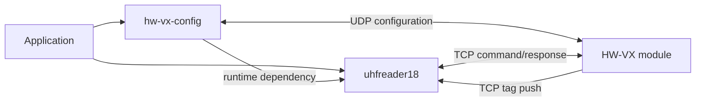

# uhfreader18

[](https://pypi.org/project/uhfreader18/)
[](https://pypi.org/project/uhfreader18/)
[](LICENSE)
[](https://github.com/xynogen/uhfreader18/actions/workflows/ci.yml)

Dependency-free Python library for the UHFReader18 binary protocol. Supports
command/response operations, CRC-validated response parsing, TCP stream
reassembly, autonomous tag reports, heartbeats, and a receive-server CLI.

`uhfreader18` talks to the RFID reader protocol. For HW-VX6330K / HW-VX6346KL
module discovery and network/serial configuration, use
[`hw-vx-config`](https://pypi.org/project/hw-vx-config/).

## Features

- Build UHFReader18 command and response frames.
- Validate CRC-16/CCITT-reflected checksums.
- Read reader information and change reader address, power, or scan time.
- Discover the reader's configured address through broadcast `0xFF`.
- Reassemble fragmented or combined TCP response streams.
- Parse autonomous `0xEE` tag reports and six-byte heartbeats.
- Filter pushed frames by reader-address allowlist.
- Run a dependency-free TCP receive server.
- Typed package with no runtime dependencies.

## Requirements

- Python 3.10 or newer
- TCP access to a UHFReader18 reader, directly or through a serial-to-Ethernet bridge

## Install

```bash
pip install uhfreader18
```

## Command Client

```python
from uhfreader18 import RfidClient

with RfidClient("192.168.1.100", 2077) as reader:
    info, address = reader.discover_address()
    print(f"address=0x{address:02X}")
    print(f"firmware={info.version}")
    print(f"power={info.power} dBm")
```

Supported high-level operations:

```python
with RfidClient("192.168.1.100", 2077) as reader:
    info = reader.get_reader_info(adr=0x00)
    reader.set_address(current_adr=0x00, new_adr=0x01)
    reader.set_power(adr=0x01, power=30)
    reader.set_scan_time(adr=0x01, scan_time=10)
```

The reader protocol handles one command at a time. `RfidClient` waits for a
complete matching response and handles TCP fragmentation internally.

## Parse a Push Stream

TCP does not preserve message boundaries. Keep one `StreamBuffer` per
connection and feed every received chunk in arrival order:

```python
from uhfreader18 import StreamBuffer

stream = StreamBuffer(allowed_readers={0x00, 0x01})
result = stream.feed(tcp_bytes)

for frame in result.frames:
    print(frame.tag, frame.reader_address, frame.command_name)

for heartbeat in result.heartbeats:
    print("heartbeat", heartbeat.hex_readable())

for error in result.errors:
    print("protocol error", error)
```

`Frame.tag` renders the response data as uppercase hex after removing trailing
NUL bytes. It remains an opaque report value: available captures do not yet
prove where flags, antenna metadata, EPC, and padding split for every reader.

## Build Frames

```python
from uhfreader18 import Command, Status, build_command_frame, build_response_frame

command = build_command_frame(0x00, Command.GET_READER_INFO)
report = build_response_frame(
    0x00,
    Command.TAG_REPORT,
    Status.SUCCESS,
    bytes.fromhex("2000708C2B380B2D00000000"),
)
```

## Receive Server

```bash
uhfreader18-server
uhfreader18-server --host 0.0.0.0 --port 2077
uhfreader18-server --allowed-readers 00,01
uhfreader18-server --fields tag,reader,peer
uhfreader18-server --debug
```

The server validates and logs reports. Applications needing custom sinks should
use `StreamBuffer` directly.

## Protocol

Response frame:

```text
Len | Adr | reCmd | Status | Data[] | CRC-16 LSB | CRC-16 MSB
```

Command frame:

```text
Len | Adr | Cmd | Data[] | CRC-16 LSB | CRC-16 MSB
```

CRC parameters:

- preset: `0xFFFF`
- polynomial: `0x8408`
- storage: little-endian

Observed heartbeat:

```text
56 00 00 00 00 00
```

## Package Relationship



- `hw-vx-config`: HW-VX discovery, network settings, serial settings, DHCP, reboot.
- `uhfreader18`: RFID command/response and autonomous push-stream protocol.

## Development

```bash
python -m venv .venv
. .venv/bin/activate
pip install -e ".[dev]"
ruff check src tests
ruff format --check src tests
pyright
pytest
python -m build
python -m twine check dist/*
```

Tests use fake sockets and captured frame bytes; no hardware is required.

## Current Limits

- High-level inventory/read/write tag methods are not implemented.
- `0xEE` payload fields remain opaque until more hardware captures establish layout.
- Networking API is synchronous; no async client or server contract.
- Hardware verification currently covers the captured push frame and operations inherited
  from `hw-vx-config`; test additional reader firmware before relying on uncommon commands.

## License

MIT — see [`LICENSE`](LICENSE).
